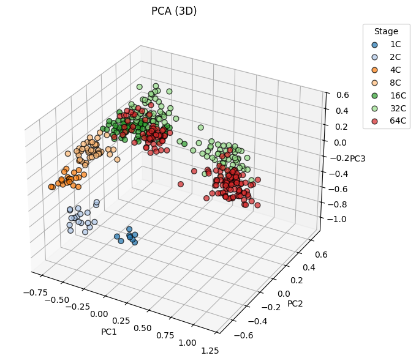
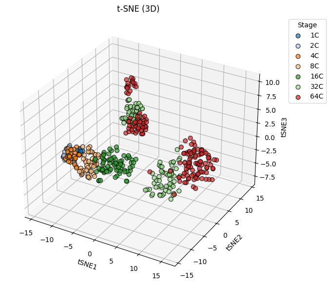
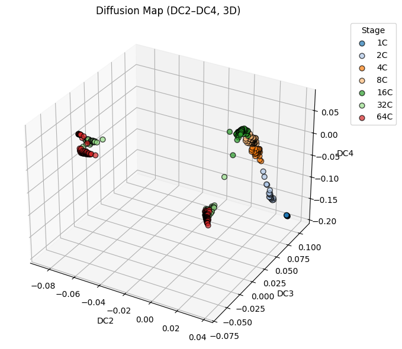

# Single-Cell RNA-Seq Analysis of Mouse Embryo Cells

This repository contains a Jupyter Notebook that performs end-to-end preprocessing, dimensionality reduction, clustering, and visualization of single-cell gene expression data from early mouse embryo development.

---

## Table of Contents

1. [Project Overview](#project-overview)  
2. [Dataset](#dataset)  
3. [Environment & Dependencies](#environment--dependencies)  
4. [Installation](#installation)  
5. [Usage](#usage)  
6. [Notebook Structure](#notebook-structure)  
7. [Results & Visualizations](#results--visualizations)   
8. [License](#license)  

---

## Project Overview

This notebook demonstrates a robust, reproducible pipeline for analyzing single-cell RT-qPCR data (442 cells × 48 genes) collected from mouse embryos across multiple developmental stages (1C, 2C, 4C, 8C, 16C, 32C, 64C). We focus on:

- **Loading & QC**: Reading raw counts from an Excel file (`mmc4.xls`), inspecting missing values, and parsing cell-stage annotations.  
- **Filtering & Normalization**: Removing lowly expressed genes, selecting highly variable genes (HVGs), total-count normalization, and log-transformation via Scanpy.  
- **Outlier Detection**: Identifying potential outlier cells in the HVG space using IsolationForest.  
- **Dimensionality Reduction**: Applying four complementary techniques—PCA, t-SNE, Spectral Embedding (Laplacian Eigenmaps), and Diffusion Map (via Scanpy)—to project cells into 3D.  
- **Clustering & Evaluation**: Running Leiden clustering on the k-NN graph and computing the Adjusted Rand Index (ARI) against known developmental stages.  
- **Visualization**: Generating interactive (or static) 3D scatter plots colored by stage to highlight transcriptional trajectories.

The goal is to showcase not only multiple embedding strategies, but also best practices for single-cell preprocessing, metadata parsing, and quantitative evaluation of unsupervised clustering against ground truth labels.

---

## Dataset

- **Source File**: `mmc4.xls`  
- **Dimensions**: 442 cells × 49 columns (1 "Cell" identifier column + 48 gene expression columns)  
- **Cell Identifiers**: Strings such as "1C 1", "2C 1.1", "4C 2.3", … where prefixes (`1C`, `2C`, `4C`, `8C`, `16C`, `32C`, `64C`) indicate developmental stage.  
- **Genes Measured**: 48 marker genes (e.g., Actb, Ahcy, Aqp3, etc.) measured by single-cell RT-qPCR.

Before running the notebook, place `mmc4.xls` in the same directory as the notebook (or update the file path accordingly).

---

## Environment & Dependencies

This project uses Python 3.8+ and the following key libraries:

- [Scanpy](https://scanpy.readthedocs.io/): single-cell preprocessing, normalization, PCA, k-NN graph, diffusion map, and Leiden clustering  
- [scikit-learn](https://scikit-learn.org/): PCA, t-SNE, Spectral Embedding, and IsolationForest  
- [numpy](https://numpy.org/): array manipulation  
- [pandas](https://pandas.pydata.org/): tabular data handling  
- [matplotlib](https://matplotlib.org/): 3D scatter plotting  
- [seaborn](https://seaborn.pydata.org/) (optional): additional styling  
- [xlrd](https://pypi.org/project/xlrd/): reading Excel (`.xls`) files

A minimal `environment.yml` (for Conda) or `requirements.txt` (for pip) is provided below.

### Conda (environment.yml)

```yaml
name: sc_embed_env
channels:
  - conda-forge
  - defaults
dependencies:
  - python=3.8
  - numpy
  - pandas
  - scikit-learn
  - scanpy
  - matplotlib
  - seaborn
  - xlrd
```

### Pip (requirements.txt)

```
numpy>=1.20
pandas>=1.2
scikit-learn>=1.0
scanpy>=1.8
matplotlib>=3.3
seaborn>=0.11
xlrd>=1.2
```

---

## Installation

1. **Clone this repository**

   ```bash
   git clone https://github.com/Reza-Sh83/Single-Cell-Analysis.git
   cd Single-Cell-Analysis
   ```

2. **Create & activate the environment**

   * **Conda**:

     ```bash
     conda env create -f environment.yml
     conda activate sc_embed_env
     ```
   * **Pip** (inside a virtualenv):

     ```bash
     python -m venv venv
     source venv/bin/activate
     pip install -r requirements.txt
     ```

3. **Ensure data file is present**
   Place `mmc4.xls` in the root of this repository (next to the notebook).

4. **Launch Jupyter Notebook**

   ```bash
   jupyter notebook
   ```

   Then open `SingleCell_Analysis.ipynb` in your browser.

---

## Usage

Once dependencies are installed and the environment is activated:

1. **Open the notebook**:

2. **Execute cells sequentially** (Shift + Enter)

   * The first cell contains a high-level project description.
   * Subsequent cells walk through each step: importing libraries, loading data, parsing stages, filtering, normalization, outlier detection, embeddings, clustering, and visualization.

3. **Inspect / modify parameters**

   * In **Section 3**, you can adjust `min_cells` (for gene filtering) or `n_top_genes` (for HVG selection).
   * In **Section 4**, you can change the contamination rate for `IsolationForest` or skip outlier removal entirely.
   * In **Section 7**, modify t-SNE parameters (e.g., `perplexity`, `n_iter`).
   * In **Section 9**, adjust `n_neighbors` for building the k-NN graph, or `n_comps` for diffusion map.
   * In **Section 10**, change the Leiden clustering `resolution`.

---

## Notebook Structure

Below is a summary of each section and its purpose:

1. **Setup & Imports**

   * Set global random seed
   * Import all required libraries
   * Define a reusable `plot_3d_embedding` helper function

2. **Load Raw Data & Parse Stages**

   * Read `mmc4.xls` into a Pandas DataFrame
   * Inspect missing values and drop incomplete rows
   * Parse `Cell` names with regex (e.g., `1C`, `2C`, … `64C`) to create a `Stage` annotation

3. **Build AnnData, Filter Genes, and Normalize**

   * Convert raw counts to `AnnData` object
   * Filter out genes expressed in fewer than 3 cells
   * Identify highly variable genes (top 2000)
   * Total-count normalize (to 10 000 counts per cell) and log1p transform
   * Assign a distinct color to each stage

4. **Outlier Detection & Removal (Optional)**

   * Fit an `IsolationForest` on log-transformed HVG expression
   * Remove flagged outlier cells (1% contamination by default)

5. **Basic QC Metrics**

   * Print number of cells per developmental stage
   * Compute a quick PCA (10 components) on HVG space and display the first three explained‐variance ratios

6. **Principal Component Analysis (PCA)**

   * Run PCA (n\_components = 3) on log-transformed HVG data
   * Print explained variance for PC1–PC3
   * Generate a 3D scatter plot (PC1 vs. PC2 vs. PC3) colored by stage

7. **t-SNE (on PCA‐Reduced Space)**

   * Project data to 50 PCs (or fewer, if HVG count < 50)
   * Run t-SNE (n\_components = 3, default perplexity = 30, random\_state = 42) on PC space
   * Print final KL divergence
   * 3D scatter: t-SNE1 vs. t-SNE2 vs. t-SNE3, colored by stage

8. **Spectral Embedding (Laplacian Eigenmaps)**

   * Compute a 3D Graph‐Laplacian embedding (n\_neighbors = 12)
   * 3D scatter: SE1 vs. SE2 vs. SE3, colored by stage

9. **Diffusion Map (Scanpy)**

   * Run PCA to 50 dims (or fewer if limited)
   * Build a Gaussian‐kernel k-NN graph (n\_neighbors = 13, use PCA representation)
   * Compute diffusion map (first 4 diffusion components)
   * Print the first five diffusion eigenvalues
   * 3D scatter: DC2 vs. DC3 vs. DC4, colored by stage

10. **Leiden Clustering & Adjusted Rand Index (ARI)**

    * Apply Leiden clustering (resolution = 0.5) on the k-NN graph
    * Compare Leiden labels vs. true `Stage` labels via ARI
    * Print ARI score and number of clusters found

---

## Results & Visualizations

* **Stage Parsing**
  All 442 cells were correctly assigned one of seven stages: `1C`, `2C`, `4C`, `8C`, `16C`, `32C`, or `64C`.

* **QC Summaries**

  * Cell counts per stage (example):

    ```
    Stage
    1C       8
    2C      19
    4C      23
    8C      44
    16C     75
    32C    109
    64C    159
    ```
  * PCA explained variance (example):

    ```
    PC1: 42.15%
    PC2: 11.04%
    PC3: 9.55%    
    ```

* **3D Embedding Plots**

  * **PCA**: Early separation of stages along PC1/PC2/PC3 demonstrating monotonic progression from 1C → 64C.
    
  * **t-SNE**: Nonlinear clusters corresponding to distinct "branch points" at 4C and 8C transitions.
    
  * **Diffusion Map**: Smooth "pseudotime" ordering from 1C → 64C visible along DC2.
    
---

## License

This project is released under the [MIT License](LICENSE). Feel free to adapt, reuse, and modify for your own research or teaching.

---
